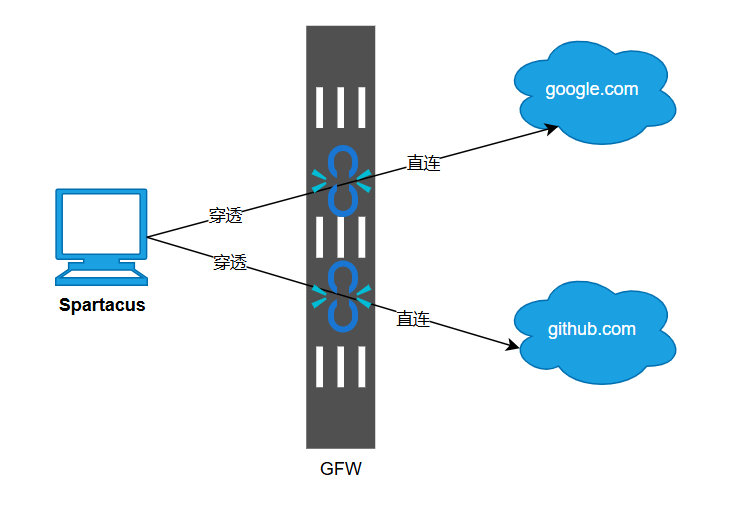
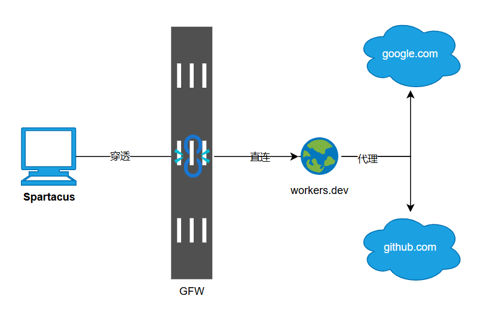

# Spartacus
斯巴达克斯，捍卫网络自由。

### 穿透直连
多种领先技术多管齐下，[穿透GFW](https://rentry.co/Your_State_is_Not_Mine_zh_CN)直连访问除IP封锁之外的所有服务，敏感时期稳定性依然坚如磐石。

### 智能中继[可选]
配合自行注册免费的Cloudflare worker做中继服务，让你以更快的物理路线连接海外资源，流量绝对不是瓶颈。

### 使用限制
1. 30天的免费试用，从首次安装起算
2. 仅支持win-x64、linux-x64和linux-musl-x64
3. 严禁用于从事黄赌毒、发表不当言论等违法行为，所有后果自负

### 快速下载
1. [Spartacus-win-x64.exe](https://gh.llkk.cc/https://github.com/spartacus-soft/spartacus/releases/download/1.1.6/Spartacus-win-x64.exe)
2. [Spartacus-linux-x64.tar.gz](https://gh.llkk.cc/https://github.com/spartacus-soft/spartacus/releases/download/1.1.6/Spartacus-linux-x64.tar.gz)
3. [Spartacus-linux-musl-x64.tar.gz](https://gh.llkk.cc/https://github.com/spartacus-soft/spartacus/releases/download/1.1.6/Spartacus-linux-musl-x64.tar.gz)

### 技术要点
1. 国内外分离DoH抗DNS污染
2. 国内外IP域名自动智能分流
3. 国外TCP连接智能防护技术
4. cloudfare workers.dev中继技术

### 优惠活动
Star本项目并创建一个Issue留下你的`安全邮箱`，赠送激活码。
